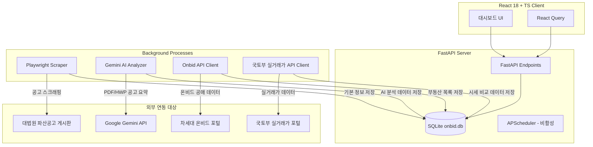

# 온비드 및 대법원 파산공매 추천 서비스 (OnBid & Bankruptcy Auction Finder)

온비드(OnBid) 차세대 공매 데이터 API 및 대법원 파산 공고 데이터를 기반으로 부동산 및 자산을 분석하고 추천하는 풀스택 웹 어플리케이션입니다. 
시세 대비 저렴한 공매/파산 물건을 자동으로 찾고, 위험 요소를 분석하여 투자자에게 유용한 대시보드를 제공합니다.

---

## 🏗 시스템 아키텍처 및 구성 (System Architecture)

본 서비스는 크게 **온비드 공매 추천** 부문과 **대법원 파산 자산 매각** 부문의 투-트랙 구조로 동작합니다.



### 1. 프론트엔드 (Frontend) - 클라이언트 사이드
- **핵심 프레임워크**: `React 18` + `TypeScript`
- **빌드 툴 및 개발 서버**: `Vite` (포트 `5173` 기동)
  - **백엔드 프록시**: `vite.config.ts`에서 `/api` 경로를 백엔드(`localhost:8000`)로 자동 프록시하여 CORS 문제를 회피합니다.
- **상태 관리 및 데이터 페칭**: `@tanstack/react-query`를 통한 실시간 동기화 상태 조회 및 캐싱
- **UI 및 스타일링**: `TailwindCSS` 및 `lucide-react` 아이콘 라이브러리

### 2. 백엔드 (Backend) - 서버 사이드
- **핵심 프레임워크**: `FastAPI` (포트 `8000` 기동, Swagger API 문서: `/docs`)
- **데이터베이스**: `SQLite` + `SQLAlchemy` (ORM)
  - `backend/onbid.db`에 수집된 공매 물건, 파산 자산 매각 공고, 국토부 실거래가 데이터 등을 1:1 매핑하여 저장합니다.
  - SQLite의 동시성 제어 및 락(Lock) 방지를 위해 **WAL(Write-Ahead Logging) 모드**를 활성화하고 있습니다.

### 3. 데이터 수집 & 분석 엔진 (Scrapers & Workers)
- **온비드 공매 수집**:
  - `backend/app/services/sync_service.py`에서 차세대 온비드 OpenAPI(`getRlstCltrList2`)를 비동기 호출합니다.
  - **국토교통부 실거래 API (`RTMSDataSvcAptTrade`)**와 연동하여 동 단위 3개월 내 아파트 매매 실거래가 중간값(Median)을 추출하고 시세 차익(Gap%)을 자동 연산합니다.
- **대법원 파산공고 수집 & AI 분석**:
  - **Phase 1 (목록 수집)**: `backend/app/services/scourt_scraper.py`에서 Playwright(Headless Chromium)를 사용해 대법원 경매/파산공고 게시판의 전체 목록을 빠르게 긁어와 `bankruptcy_properties` 테이블에 저장합니다.
  - **Phase 2 (AI 분석)**: `backend/analyze_worker.py`가 미분석 대상 공고의 PDF 첨부파일을 다운로드하고, **Google Gemini API**를 활용해 매각 대상자산, 채무자, 주소, 최저입찰가, 매각기일 및 유의사항 요약을 추출하여 DB에 업데이트합니다.

---

## 🚀 서비스 기동 및 중지 방법 (Windows)

루트 디렉토리에 위치한 배치(`.bat`) 파일을 사용하여 서비스를 손쉽게 시작하고 중지할 수 있습니다.

### 1. 서비스 기동 방법 (`start.bat`)
루트 디렉토리에서 `start.bat`을 실행합니다. 이 스크립트는 백엔드와 프론트엔드를 각각 별도의 독립 창으로 안전하게 실행합니다.

```powershell
.\start.bat
```

* **동작 내용**:
  1. **백엔드 시작**: `backend` 폴더 내 Python 가상환경(`.venv`)을 활성화하고 uvicorn 서버를 실행합니다. (`http://localhost:8000`)
  2. **프론트엔드 시작**: `frontend` 폴더에서 Vite 개발 서버를 기동합니다. (`http://localhost:5173`)
* **접속 주소**:
  * 사용자 화면: http://localhost:5173
  * 백엔드 API 문서: http://localhost:8000/docs

### 2. 서비스 중지 방법 (`stop.bat`)
서비스를 종료하고 실행 중인 모든 포트를 닫으려면 루트 디렉토리에서 `stop.bat`을 실행합니다.

```powershell
.\stop.bat
```

* **동작 내용**:
  * CMD 창 제목이 `OnBid-Backend` 및 `OnBid-Frontend`로 시작하는 모든 콘솔 창과 그 하위 프로세스(uvicorn, node 등)를 `taskkill` 명령어를 통해 강제로 안전하게 종료시킵니다.
  ```powershell
  taskkill /FI "WindowTitle eq OnBid-Backend*" /T /F
  taskkill /FI "WindowTitle eq OnBid-Frontend*" /T /F
  ```

---

## ⏰ 주기적 크롤링 스케줄 (Periodic Crawling)

기존 Python 내부의 APScheduler 방식 대신, 백그라운드 구동의 안정성과 리소스 격리를 위해 **윈도우 작업 스케줄러(Windows Task Scheduler)**를 활용하여 크롤링 스케줄링을 수행하고 있습니다.

### 1. 스케줄 상세
윈도우 작업 스케줄러에 등록되어 **매일 하루 3회** 자동으로 최신 파산 자산 매각 공고 데이터를 스크래핑하고 AI 분석을 연계하여 수행합니다.

| 작업 스케줄러 이름 | 자동 실행 시간 (매일) | 동작 내용 |
| :--- | :--- | :--- |
| **`Onbid_Auction_Sync_0000`** | **00:00** (자정) | 대법원 파산 공고 목록 수집 및 미분석 건 AI 분석 순차 실행 |
| **`Onbid_Auction_Sync_1200`** | **12:00** (정오) | 대법원 파산 공고 목록 수집 및 미분석 건 AI 분석 순차 실행 |
| **`Onbid_Auction_Sync_1800`** | **18:00** (저녁) | 대법원 파산 공고 목록 수집 및 미분석 건 AI 분석 순차 실행 |

### 2. 크롤링 스케줄러 등록 방법 (`setup_scheduler.bat`)
만약 작업 스케줄러를 최초로 등록하거나 일정이 변경된 경우, 루트 디렉토리에서 관리자 권한 혹은 일반 터미널에서 다음 스크립트를 실행하여 윈도우 스케줄러에 자동 등록합니다.

```powershell
.\setup_scheduler.bat
```

### 3. 백그라운드 자동화 실행 체인 (Execution Chain)
작업 스케줄러가 트리거되면 시스템 내부적으로 화면을 방해하지 않는 **무음(Hidden) 모드**로 크롤링을 처리합니다.

```
[윈도우 작업 스케줄러 트리거]
         │
         ▼ (wscript.exe 호출)
[run_hidden.vbs]
         │
         ▼ (창을 숨겨서 백그라운드로 실행)
[run_all_sync.bat]
         │
         ├─► [python debug.py] 실행 (Phase 1: 대법원 공고 목록 수집)
         │
         ├─► [10초 대기] (데이터베이스 커밋 안정화 및 다음 단계 준비)
         │
         └─► [python analyze_worker.py] 실행 (Phase 2: 다운로드 및 Gemini AI 분석)
```

### 4. 크롤링 로그 확인 방법
백그라운드에서 진행된 스케줄 크롤러의 동작 이력 및 수집 로그는 다음 위치의 로그 파일에서 실시간으로 확인할 수 있습니다.
- **스케줄러 전체 실행 이력**: `backend/sync_task.log` (배치 스크립트 실행 일시 및 단계별 결과 기록)
- **Phase 1 수집 상세 로그**: `backend/debug_log.txt` (Playwright 수집 진척도, 페이지 이동 및 DB 저장 기록)
- **Phase 2 AI 분석 상세 로그**: `backend/analyze_log.txt` (Gemini API 호출 결과 및 파싱 결과 상세 기록)

---

## 🧠 핵심 비즈니스 로직 요약

1. **온비드 시세차익 (Gap) 분석**:
   ```text
   Gap% = (국토부 아파트 실거래 중간값 - 최저입찰가) / 국토부 아파트 실거래 중간값 × 100
   ```
   * 이 격차율이 양수(+)이고 설정된 기준(`min_gap_pct` 기본 10%) 이상인 물건을 추출해 투자 메리트가 높은 추천 등급을 선정합니다.

2. **추천 점수 (Score) 산정 공식**:
   ```text
   Score = (Gap% × 0.7) + (유찰횟수_가중치 × 0.3)
   ※ 만약 위험 요소(유치권, 법정지상권 등 특이사항)가 발견되면 최종 점수의 50%를 강제 감점 처리합니다.
   ```

3. **온비드 공식 공고 이동 로직 (보안 회피)**:
   차세대 온비드 시스템은 다이렉트 외부 링크 상세 페이지 접근 시 404 차단 정책이 작동합니다. 이를 해결하고자, `PropertyCard.tsx`에서 상세 카드 클릭 시 클립보드에 **온비드 관리번호를 자동 복사**하고 안전한 **온비드 공식 메인 홈 화면(`https://www.onbid.co.kr`)**을 띄워 사용자가 직접 붙여넣기를 통해 보안 차단 없이 즉시 해당 물건을 조회할 수 있도록 UX를 개편했습니다.
